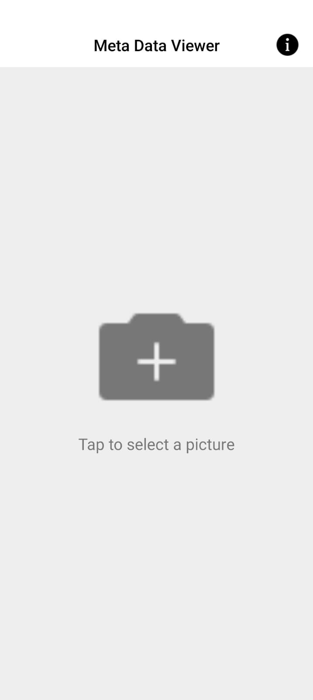
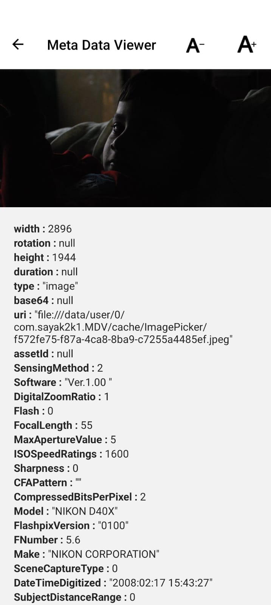

# About App

Introducing the Image Metadata Viewer, the ultimate tool for viewing and analyzing image metadata on your Android device. With this app, you can easily view detailed information about any image, including the camera used, the date and time the photo was taken, and even GPS location data.

The app supports a wide range of image formats, including JPEG, PNG, and RAW files. It also has a user-friendly interface that makes it easy to navigate and find the information you need.

Other features of the Image Metadata Viewer include the ability to view histograms and EXIF data, as well as the ability to share image metadata with others via email or social media.

Overall, the Image Metadata Viewer is a must-have app for anyone who works with images and wants to easily view and manage image metadata on their Android device.

# Setting up Enviorment

```bash
$ npm i
$ npx expo start
```

# Android internal distribution build (.apk)

https://expo.dev/accounts/sayak2k1/projects/meta-data-viewer/builds/d09e951c-23c9-43c0-8304-02b45886efff

# Screenshots




